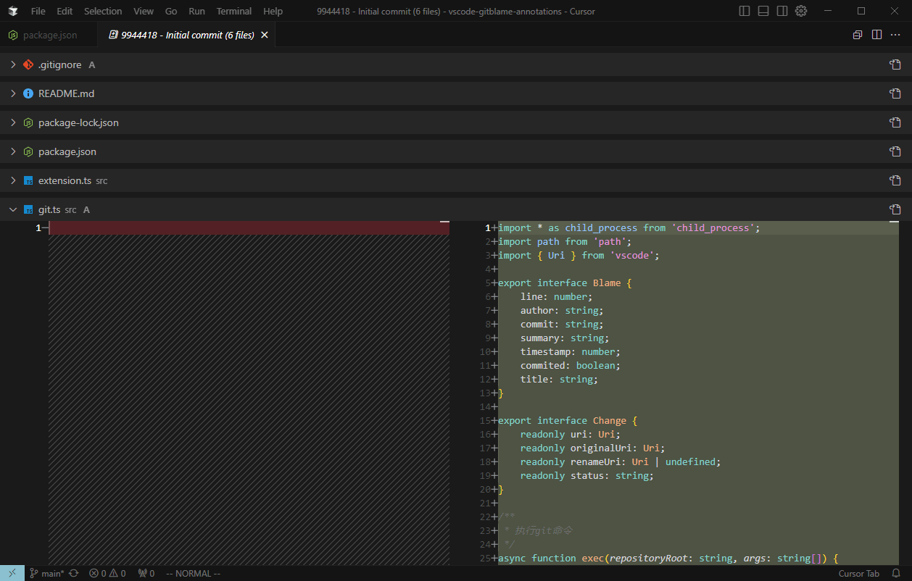
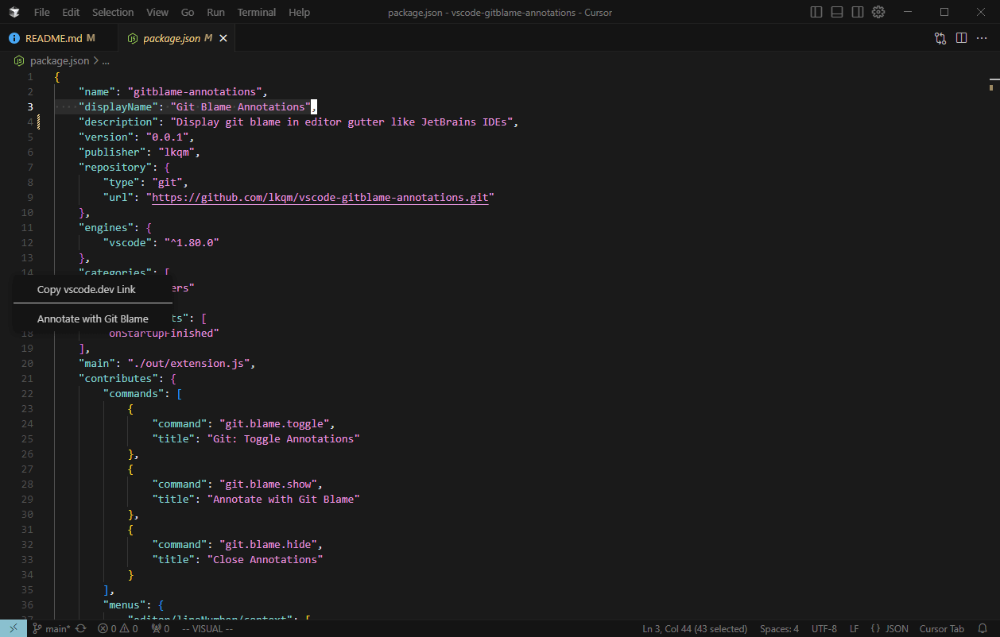

# Git Blame Annotations
Display git blame in editor gutter like JetBrains IDEs.

## Features
- Display commit information for each line.
- Hover for commit information.
- Click to view commit changes.

## Screnshoots




## Usage
1. Install `Git Blame Annotations` extension.
2. Right-click menu on line numbers.
3. Click "Annotate with GitBlame" or "Close Annotations".

## Commands
- `git.blame.toggle` - Toggle Annotations 
- `git.blame.show` - Annotate with Git Blame
- `git.blame.hide` - Close Annotations

## Develop

```
# Run & Debug
npm install
npm run compile

# Build
npm install -g @vscode/vsce
vsce package

# Publish
vsce login <publisher>
vsce publish
```
