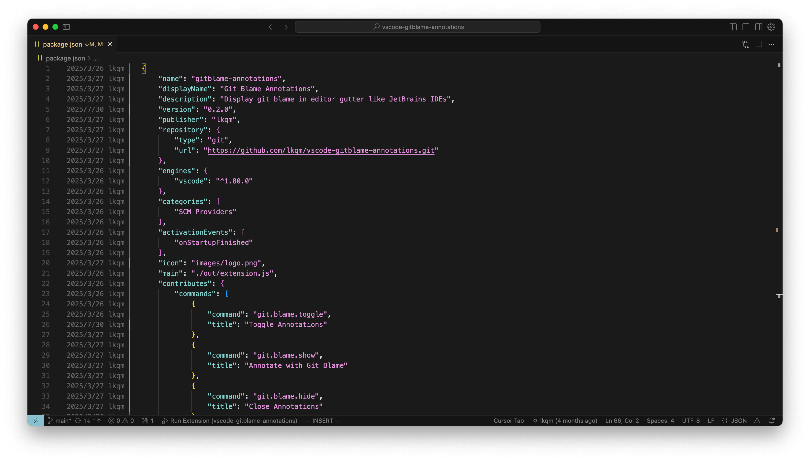

# Git Blame Annotations
Display git blame in editor gutter like JetBrains IDEs or GitLens.


## Features
- Display commit information for each line.
- Hover for commit information.
- Click to view commit changes.
- View line history.

## Usage
1. Install `Git Blame Annotations` extension.
2. Right-click menu on line numbers.
3. Click "Annotate with Git Blame" or "Close Annotations".
4. Hover annotation view commit detail.

## Configuration
- `gitblame.dateFormatStyle`: The date format for blame annotations. (Pick from several supported date formats)
- `gitblame.authorNameStyle`: Whether to show the Commit Author's full name, or only first/last
- `gitblame.showCommitNumber`: Show the file revision number for each blamed commit.
- `gitblame.mergeCommitLines`: Show annotation only on the first line of each commit block, leaving subsequent lines blank.
- `gitblame.highlightChangedLines`: Highlight all lines of the commit under the cursor.

## Commands
- `git.blame.toggle` - Toggle Annotations (shortcut: ctrl+alt+b)
- `git.blame.show` - Annotate with Git Blame
- `git.blame.hide` - Close Annotations（shortcut: Esc）
- `git.blame.viewLineHistory` - View Line History

## Develop

```
# Run & Debug
npm install
npm run compile

# Build
npm install -g @vscode/vsce
vsce package

# Publish
vsce login <publisher>
vsce publish
```
